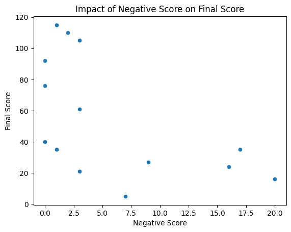
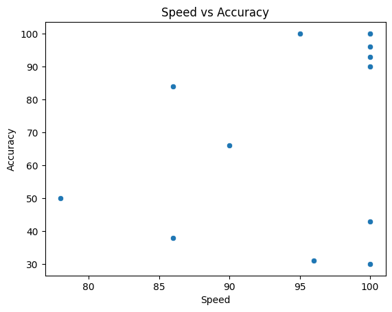
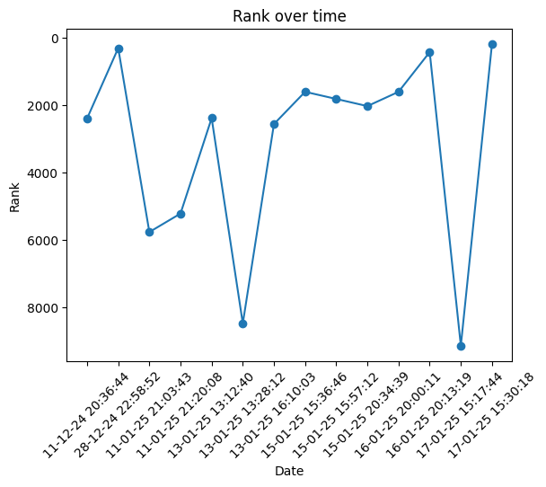

# NEET RANK PREDICTION

### Setup information

> For setup information please refer to the file `setup_steps.md`

### Schema and Intial data exploration, Analysis

> The exploratory analysis and the analysis of the stident performance by factors are done in the file `EDA.ipynb` in `data folder`

#### Highlights
    **Weak Topics**
    > `Principles of Inheritance and Variation` has the **lowest score (12.0) and lowest accuracy(30%)**, indicating a need for more focused revision.
    >`Respiration and Gas Exchange` also has a low score (24.0), suggesting *difficulty in this topic*.
    > `Human Reproduction` (40.0) and seconfd lowest accuracy (38%) and `Reproductive Health` (52.0) are also areas *requiring improvement*.
    > Consolidating title vise: Even though `human physiology` has a mean score of 64, the topic `Respiration and Gas Exchange` needs improvement. Reproduction and Reproductive Health are *difficult titles*.
    - 

    **Mistake Pattern**

    > **Reproduction** has a highest negative score (16.5), suggesting students struggle with answer selection in this topic.
    > **Principles of Inheritance and Variation** has the highest negative score (7.0), indicating frequent incorrect attempts.
    > It is observed that with increase in the negative score the final score is heavily impacted.

    **Rank Progression**

    > Fluctuations are present, it indicates inconsistent performance, requiring a more structured study plan.

#### Graphs
    
    
    
